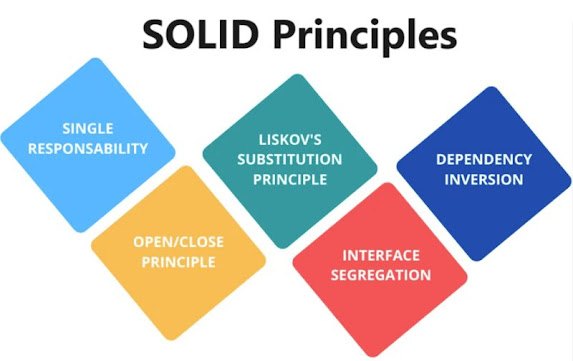

# Học SOLID trong code là như thế nào?

Khi nhắc đến việc viết code "chất", không chỉ là việc bạn có thể làm cho code chạy đúng mà còn là khả năng mở rộng, bảo trì và tái sử dụng nữa. Ai mà chẳng thích một code mà sau này mình hoặc đồng nghiệp còn có thể dễ dàng sửa lại mà không sợ phá vỡ hết mọi thứ đúng không? 😎

Vậy nguyên tắc SOLID là gì? Đơn giản thôi! SOLID là một bộ quy tắc giúp bạn viết code dễ hiểu, dễ bảo trì và dễ phát triển thêm tính năng sau này. Tưởng tượng nó như bộ công cụ siêu việt giúp bạn làm việc nhanh chóng mà không lo bị vướng vào những lỗi lặt vặt. Hãy cùng khám phá nhé!



## SOLID là gì? 🧩

SOLID là từ viết tắt của 5 nguyên tắc cực kỳ hữu ích do Robert C. Martin (Uncle Bob) đề xuất. Nó sẽ giúp bạn viết code vừa dễ đọc, vừa dễ sửa và dễ thêm tính năng sau này. Nếu bạn chưa biết về SOLID, đừng lo, bạn không hề lạc hậu đâu. Thực ra, nếu muốn viết code "ngon", biết SOLID là một bước đi vô cùng quan trọng đấy!

## 1. S - Single Responsibility Principle (SRP) 🛠️

Nguyên tắc này đơn giản thôi: Mỗi lớp (class) chỉ nên có một lý do để thay đổi. Tưởng tượng một nhân viên nhà hàng vừa phải nấu ăn, vừa phải dọn dẹp, lại còn phải phục vụ khách hàng. Quá tải đúng không? Vậy thì trong code cũng vậy, mỗi phần của code chỉ nên đảm nhận một công việc thôi!

Ví dụ không tốt:

```
class DataProcessor:
    def process_data(self, data):
        print("Processing data...")

    def log(self, message):
        print(f"Log: {message}")
```

Ở đây, lớp `DataProcessor` vừa làm nhiệm vụ xử lý dữ liệu, vừa làm luôn nhiệm vụ ghi log. Bạn sẽ phải thay đổi hết lớp này nếu muốn thay đổi cách ghi log.

Ví dụ tốt:

```
class DataProcessor:
    def process_data(self, data):
        print("Processing data...")

class Logger:
    def log(self, message):
        print(f"Log: {message}")
```

Giờ thì xử lý dữ liệu và ghi log được tách riêng biệt, dễ dàng thay đổi bất kỳ phần nào mà không ảnh hưởng đến phần còn lại.

## 2. O - Open/Closed Principle (OCP) 🚪

Lớp phải mở để mở rộng, nhưng đóng để sửa đổi. Nghe có vẻ phức tạp nhưng thật ra đơn giản thôi. Ví dụ bạn đang bán đồ ăn trong một quán, bạn không cần phải thay đổi menu cũ khi muốn thêm món mới, chỉ cần thêm món vào menu mà không động đến những món cũ.

Ví dụ không tốt:

```
class AreaCalculator:
    def calculate_area(self, shape):
        if shape["type"] == "circle":
            return 3.14 * shape["radius"] ** 2
        elif shape["type"] == "rectangle":
            return shape["width"] * shape["height"]
```

Mỗi khi bạn thêm một hình dạng mới, bạn lại phải chỉnh sửa cả phương thức này. Không ổn chút nào.

Ví dụ tốt:

```
from abc import ABC, abstractmethod

class Shape(ABC):
    @abstractmethod
    def area(self):
        pass

class Circle(Shape):
    def __init__(self, radius):
        self.radius = radius

    def area(self):
        return 3.14 * self.radius ** 2

class Rectangle(Shape):
    def __init__(self, width, height):
        self.width = width
        self.height = height

    def area(self):
        return self.width * self.height

shapes = [Circle(5), Rectangle(4, 6)]
total_area = sum(shape.area() for shape in shapes)
print(total_area)
```

Giờ bạn có thể thêm hình tam giác hay bất kỳ hình dạng nào mà không phải chỉnh sửa gì trong phần tính diện tích. Việc thêm tính năng mới không làm ảnh hưởng đến code cũ, một cú hích cho code của bạn!

## 3. L - Liskov Substitution Principle (LSP) 🦆

Nguyên tắc này bảo rằng bạn có thể thay thế lớp cha bằng lớp con mà không làm thay đổi hành vi của chương trình. Tưởng tượng một con vịt thực sự và một con vịt đồ chơi, cả hai đều có thể "giả vờ" bay, nhưng con vịt đồ chơi thì không cần phải đẻ trứng đâu! 😉

Ví dụ không tốt:

```
class Bird:
    def fly(self):
        print("Flying")

class Penguin(Bird):
    def fly(self):
        raise NotImplementedError("Penguins can't fly")
```

Đây là lỗi vì bạn ép con chim cánh cụt phải bay, điều này không hợp lý.

Ví dụ tốt:

```
from abc import ABC, abstractmethod

class Bird(ABC):
    @abstractmethod
    def move(self):
        pass

class FlyingBird(Bird):
    def move(self):
        print("Flying")

class NonFlyingBird(Bird):
    def move(self):
        print("Walking")

birds = [FlyingBird(), NonFlyingBird()]
for bird in birds:
    bird.move()
```

Mỗi loại chim có một cách di chuyển riêng, nhưng tất cả đều tuân theo cùng một nguyên tắc, giúp chương trình chạy mượt mà hơn.

## 4. I - Interface Segregation Principle (ISP) 🔌

Hãy nghĩ về con cá voi. Bạn không thể bắt nó chạy marathon, nó chỉ cần bơi thôi! Mỗi đối tượng nên có các phương thức phù hợp với chức năng của nó, không phải cái gì cũng làm.

Ví dụ không tốt:

```
class Animal:
    def fly(self):
        pass

    def swim(self):
        pass

    def walk(self):
        pass

class Dog(Animal):
    def fly(self):
        pass  # Không dùng

    def swim(self):
        print("Swimming")

    def walk(self):
        print("Walking")
```

Ví dụ tốt:

```
class Walkable:
    def walk(self):
        pass

class Swimmable:
    def swim(self):
        pass

class Dog(Walkable, Swimmable):
    def walk(self):
        print("Walking")

    def swim(self):
        print("Swimming")
```

Phân tách interface, và ai cần gì thì làm nấy! 

Đừng bắt chó phải bay, hãy để nó làm những gì nó giỏi! 👍

## 5. D - Dependency Inversion Principle (DIP) 🔄

Các module cao cấp không nên phụ thuộc vào các module thấp cấp, mà cả hai nên phụ thuộc vào các abstraction. Nghe có vẻ khó hiểu nhưng thực ra là hãy làm cho code của bạn linh hoạt, dễ dàng thay đổi mà không ảnh hưởng đến các phần khác.

Ví dụ không tốt:

```
class MySQLDatabase:
    def connect(self):
        print("Connecting to MySQL")

class Application:
    def __init__(self):
        self.database = MySQLDatabase()

    def run(self):
        self.database.connect()
```

Ví dụ tốt:

```
from abc import ABC, abstractmethod

class Database(ABC):
    @abstractmethod
    def connect(self):
        pass

class MySQLDatabase(Database):
    def connect(self):
        print("Connecting to MySQL")

class PostgreSQLDatabase(Database):
    def connect(self):
        print("Connecting to PostgreSQL")

class Application:
    def __init__(self, database: Database):
        self.database = database

    def run(self):
        self.database.connect()

app = Application(MySQLDatabase())
app.run()

app = Application(PostgreSQLDatabase())
app.run()
```

Giờ bạn có thể thay đổi cơ sở dữ liệu mà không cần phải đụng đến mã nguồn ứng dụng. Hãy coi mỗi cơ sở dữ liệu như một loại "đồ uống" mà khách hàng yêu thích!

# Lời kết: Áp dụng SOLID ngay hôm nay! 🌟

SOLID không phải là một lý thuyết khô khan mà là những nguyên tắc cực kỳ thực tế giúp bạn viết code dễ bảo trì, mở rộng và thêm tính năng mới mà không phải lo sợ mọi thứ đổ vỡ.

Vậy nên, nếu bạn muốn trở thành một lập trình viên "đỉnh cao", đừng quên học và áp dụng SOLID trong mỗi dòng code của mình! Chắc chắn bạn sẽ thấy sự khác biệt ngay lập tức! 💻✨

Chia sẻ bài viết này nếu bạn thấy hữu ích và đừng quên thử áp dụng SOLID trong dự án tiếp theo của bạn nhé!
